# Getting Started with Create React App

This project was bootstrapped with [Create React App](https://github.com/facebook/create-react-app).

## crash course React
I followed a crash course of React to understand the fundamentals before I finish my quiz project.

I found this course on Youtube: https://www.youtube.com/watch?v=jLS0TkAHvRg .

### how I personally create a React project
I start by making my repository on GitHub and then inside this directory I do in the terminal `create-react-app .` so that I don't have 2 folders inside my React application. The dot (.) at the end creates the app without creating a new directory.

### what is React

React is an open source JavaScript library for building user interfaces.
- React is a JavaScript library.
- Building user interfaces.

### Why React?
React is one of the most popular UI libraries and is well known in the job market.

- A great community and behind it.
- A component based architecture.
- Is declarative, this means that you can tell React what you want true code, and React with his ReactDom library, will build the UI.

## What do you need for React?

- Browser.
- Node JS.
- Code editor.

## Application folder structure
@ The root level we have tree folders:
 - node_modules: this is the folder where all your dependencies are located.
 - public: this folders contains 6 files, but as a beginner you only need to focus on the index.html file. In this file normally you will not put any code.. You want React to control the UI true the `

`.
 - src: this is the folder where you will work the most during development =>
   - index.js:
   
  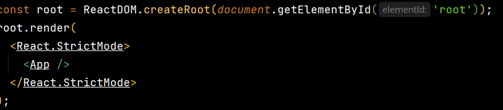

The app component is rendered inside the root present in index.js.
   - App.js:

   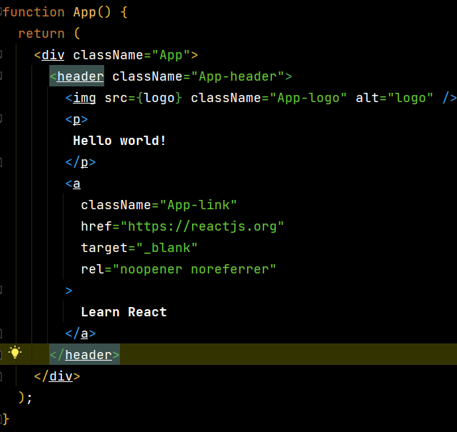

The app component represents the view of the application.

- And we also have 4 files:
    - .gitignore: to ignore files.
    - package-lock.json: this files ensures consistent installation of the dependencies.
    - package.json:  this files containes the dependencies (react and react-dom are necessary to create React application) and the scripts (start, build, test and eject) required for the project.
    - README.md: Standard readme file.

## What happens when you run the command npm start?
1) Index.html file is served in the browser and contains the root DOM node
2) Next the control enters index.js. The react dom library renders the App component onto the root DOM node
3) Inside the App.js, the app component contains the HTML, witch is ultimately displayed in the browser
   
## Components
In react a component represents a part of the user interface.
A traditional website can be broken down into a header, sidenav, main content and a footer.
Each section is represented by a component in react. All components when composed in the right way make up the entire website.

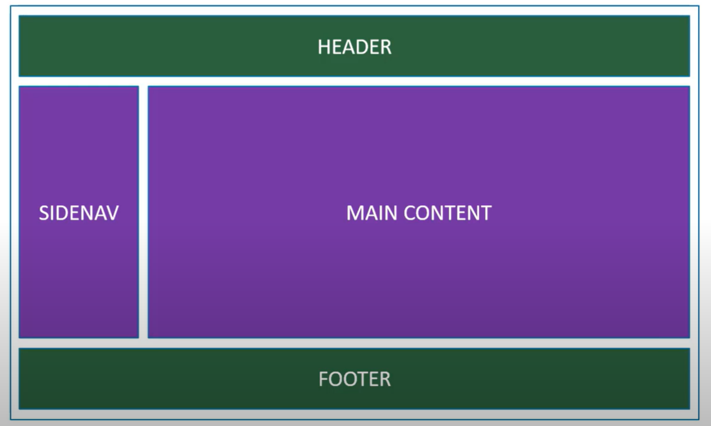

We also have a component that contains all the four components. It is called as root component and is usually named as app component.
Components are also reusable.

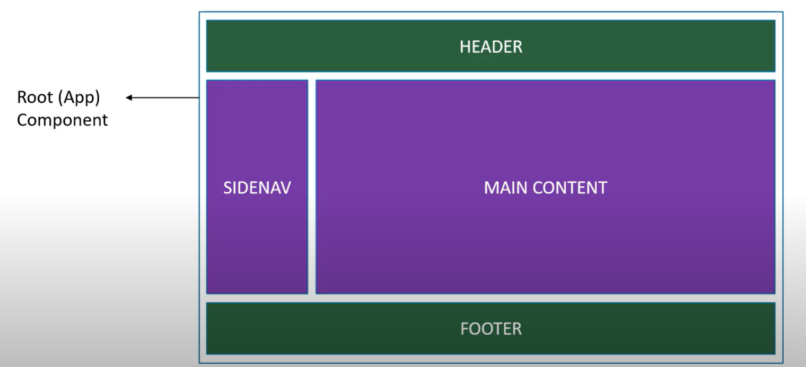

The same component can be used with different properties to display different information. For example the sidenav component can be the left sidenav as well the right sidenav. The UI can remain the same but the content can change.

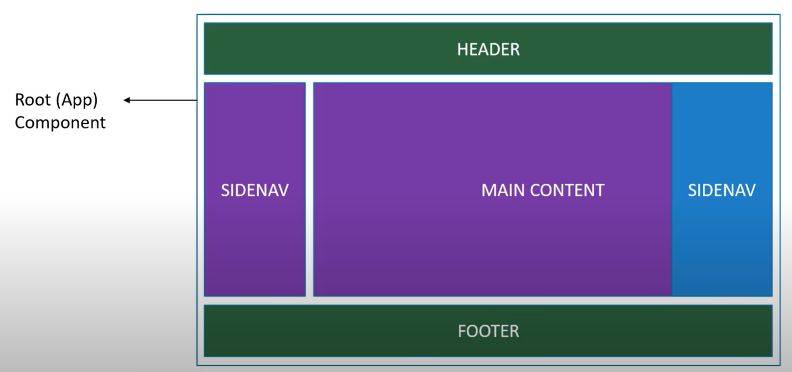

## Components
We have 2 types of components:
- Functional components: 
- Class components.

Functional components are newer and is pretty much what you need to learn in the year 2022. But for me personally I also will do my research how to work with Class components because I like working with Classes, and this comes also in handy when using other frameworks that only use class components.

## Functional components
Functional components are literally javascript functions. They may accept some input properties and return html witch describes the UI.

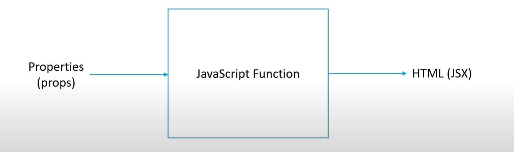

## making my first function component
First I make a folder component and then I add a js file called Greet in the folder.

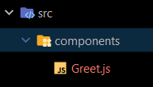

Then in the Greet component I make a function Greet and return and h1 tag with content inside.
I also export this function at the bottom of the function.

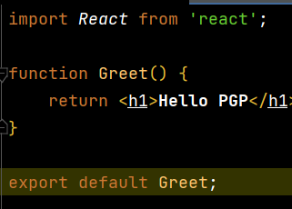

Then I import the Greet component in the App component and I put the Greet component between the div tags in the App function. The App component will render the Greet component and the App component will be rendered by the index.js file.

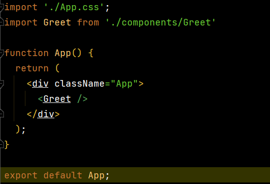

## Differences between default and name exports
The main difference is that if you use default export you can rename your import and call it whatever you want, and it still will work.

Default export:

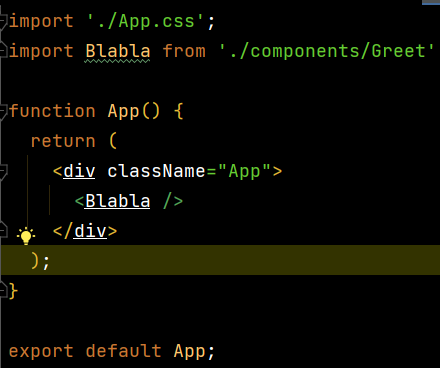

In this example I call the import Blabla and I call it again in the App function and this will work and not break my application.

Named export:

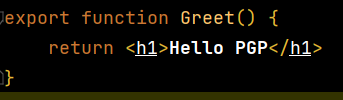

In this case I export the Greet function at the function.

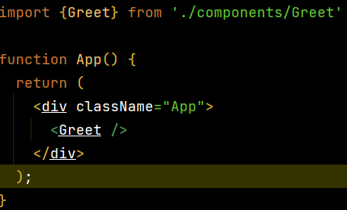

And I have to import the component using curly brackets and using the same name as my function in the Greet component.

## What is JSX?
Jsx looks like html but it isn't. It's a syntax extension to javascript. In react, jsx is what describes how the UI should look like.
It also comes with the full power of javascript library.

This are some differences between JSX and html:
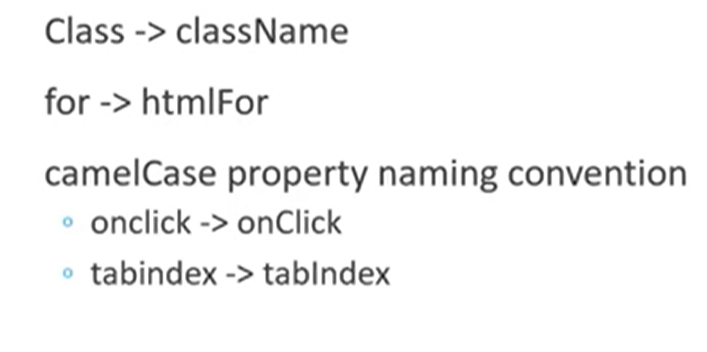

## Props
Pops(short word for properties) is the optional input that any component can accept. It allows the component content to be dynamic.

The good thing about using component is that you can reuse them many times.
Very important is that a props value can not be changed in the function.

Here is an example how to use props to make the components reusable:

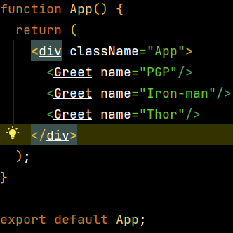

To specify a property for a component we specify them as attributes. In this case I want to specify a name prop, so I add a name attribute to Greet component in the App.js function?

How do we retrieve the value of the Greet component:

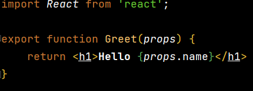

In this case I add a parameter to the function component (props) and then I replace where before was a name with `{props.name}` this way we can retrieve the value of the attribute previously set in the App component.

Passing a number as a prop/attribute:

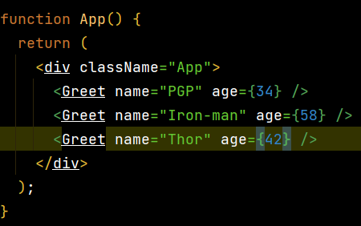

In case we need to pas a number and not a string, you need to put your number value in curly braces.

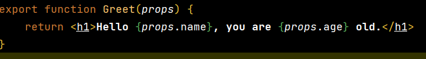

For the Greet component it's the same as before, you just give in prop and then the name(age) of the attribute set in App.js

## Children props
We can also pass unknown content using children props.

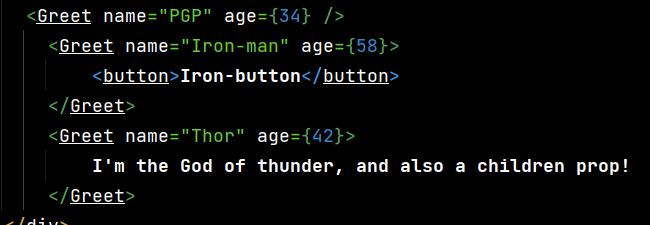

I specified some content(string and a button) between the opening en closing tag of the component. 

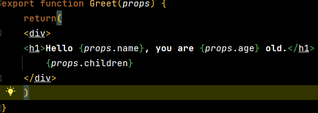

Then I retrieve the value of the children properties by calling it in the function`{props.children}`. But first you have to wrap the return in a div, otherwise it will not work.

The children props are very useful when you have to compose new components from existing components.

## State
comparison between props and state:

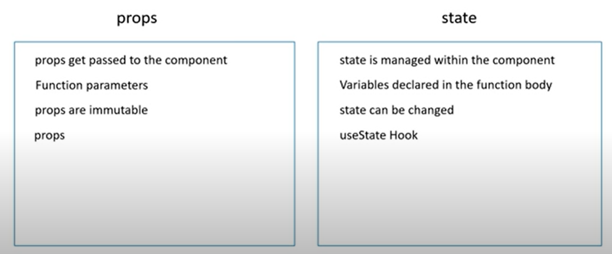

Let's make an example of how state works in a component.

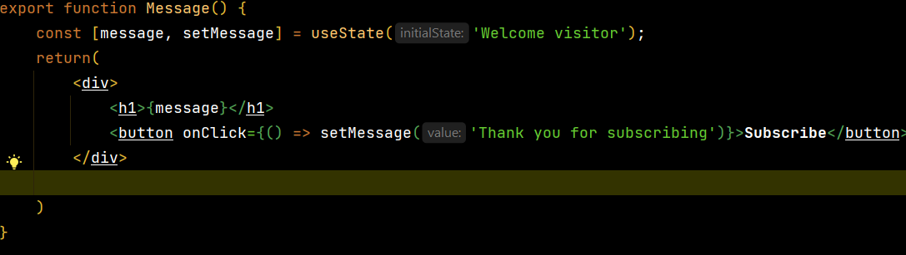

Here I make a component Message and I want to display a welcome message and change the message with a button.
I can not do this with props. Once the message is set it can never be changed.

So the solution is to use component state. 

1) first I imported the useState from react.
2) then I called the useState function in the component.
3) useState return to value which you can store two constants of an array.
4) I give the original message the name message and the one that is going to change onClick setMessage:  `const [message, setMessage]`
5) between the parentheses you can give the initial state of the first constant (message):`useState('Welcome visitor')`
6) Then I return the message `{message}` what will be the original message in the useState parentheses as show above.
7) I put the H1 and button in a div tag because React can only return one wrapper element.
8) Then on the button I add the onClick attribute. 
9) Then I assign a handler: `onClick={() => setMessage('Thank you for subscribing')}`
10) The setMessage function will update the message value of the original message and show thank you for subscribing on the click of the button.

Everytime a state changes, React will automatically update the state value.

## Hooks
Several examples of hooks

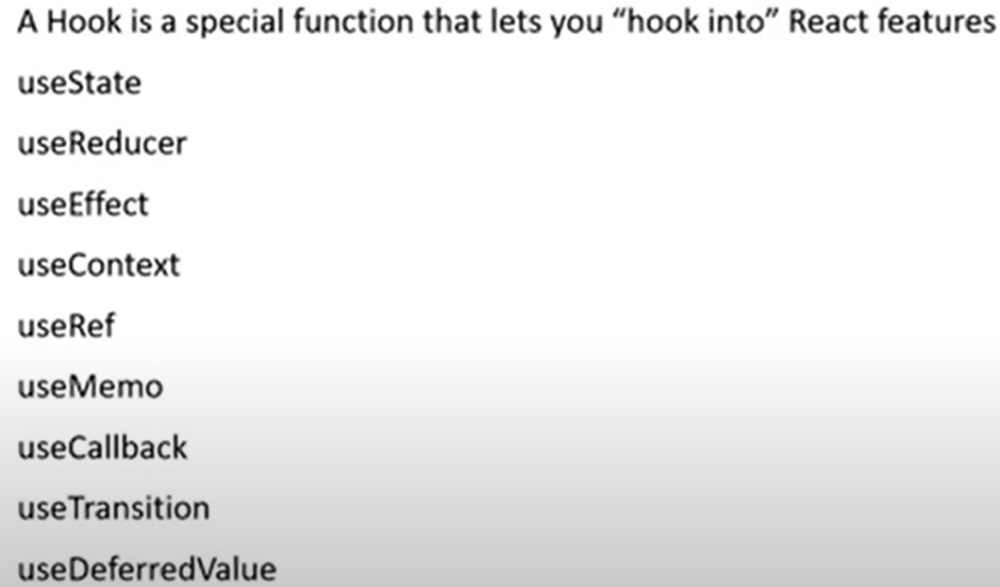

In this crash course I will be using useState, useEffect and useTransition.

## Event Handling
Every application we build typically tends to have user interaction.
When the user interacts, events are fired.
some examples of event handling:
- mouse clicks
- mouse over
- key press
- change event

In the example I will focus on click events, but the concept holds good for other events as well.

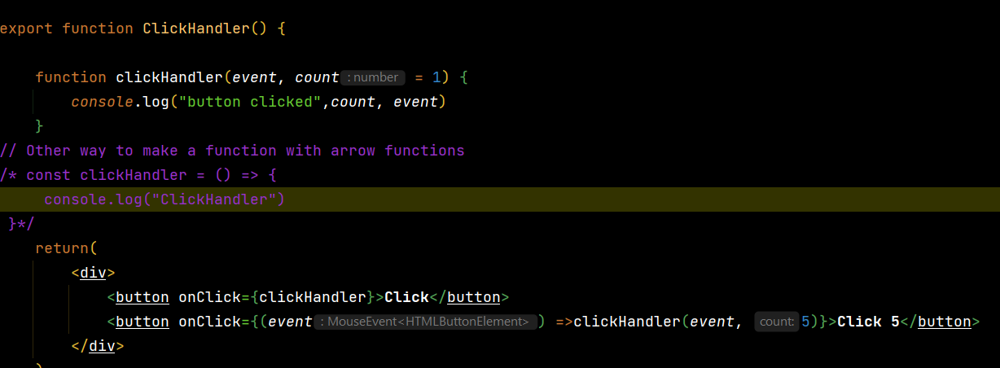

1) You always have to use camelCase with React events.
2) With jsx you pas a function as the event handler rather than a string: `onClick={clickHandler}`.
3) Then I define the clickHandler function and then to the console that the button is clicked.
4) The event handler in React automatically receives the event assets argument.
5) But for the second example I add event as a parameter and log it to the console: ` function clickHandler(event)`.
6) It's possible to add additional arguments to the event handler if necessary.
7) In this example I make another button.
8) This time the onclick handler will be an arrow function, I pass the event and also a value of 5: `onClick={(event) =>clickHandler(event, 5)}`.
9) In the click handler definition we add a new parameter count with a default value of one en we log this to the console: `function clickHandler(event, count = 1) {
   console.log("button clicked",count, event)}`.

## Parent and child component communication
What if the child component wants to communicate with the parent component?

We will still have to use props, but this time we pass in a reference to a function as props to the child component.

This example will explain how to do this:

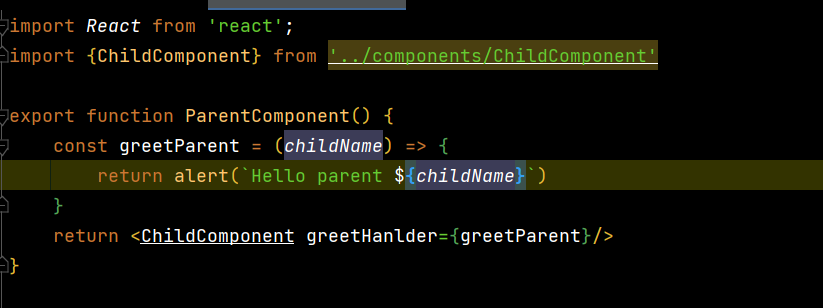
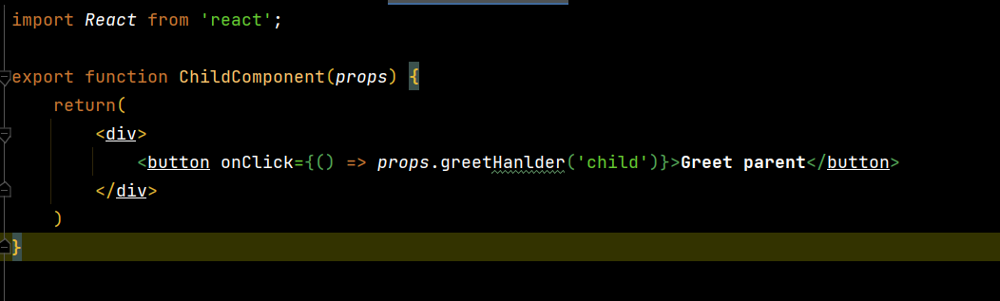

First I make the ParentComponent with a function that greets with an alert and a ChildComponent with a button.

1) I include the ChildComponent in the ParentComponent.
2) The ParentComponent I will include in the App component and add it in the jsx.
3) What I now want, when i click on the button in the ChildComponent, I want to execute defined in the ParentComponent.
4) This can we achieve using props. This time we will pass the function itself as a prop to the ChildComponent: `<ChildComponent greetHanlder={greetParent}`.
5) I can now grab hold of our function in the ChildComponent.
6) We specify props parameter: ` ChildComponent(props)` and on click of the button we call the prop `onClick={props.greetHanlder}`.
7) So I have successfully called a function in the  ParentComponent from a button in the ChildComponent by passing the function as props to the ChildComponent
8) Now let's see how to pass a parameter when calling the ParentComponent function from the ChildComponent. 
9) So we convert the onClick handler into an arrow function: `onClick={() => props.greetHanlder()}`.
10) Now I can pass in any number of parameters to the greetHanlder.
11) I pass one argument with the string child: `onClick={() => props.greetHanlder('child')}`.
12) Now I incorporate this argument in the greetParent function: `const greetParent = (childName)`.
13) We specify childName as a parameter that is the argument from the string 'child' in the ChildComponent.
14) Then we call this parameter in the alert statement: `alert(``Hello parent ${childName}``)`.
15) So in this way we have successfully passed an argument from the ChildComponent to the ParentComponent.

## Conditional rendering
let's look at two common ways to conditionally render in React

-The ternary operator:

Want that the message is conditionally rendered based on the value of isLoggedIn.

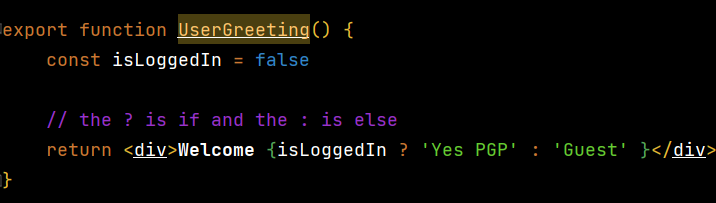

- If you're logged in (variable = true) the message welcome pgp should be displayed otherwise it should display guest (false).
- After welcome we add a pair of curly braces to evaluate a javascript expression.
- We do this like this: `
Welcome {isLoggedIn ? 'Yes PGP' : 'Guest' }
`
- So if it is true it will append Yes pgp, if it is false it will append guest.

-The short circuit operator:
When you want to render something or nothing you make use of the short circuit operator.

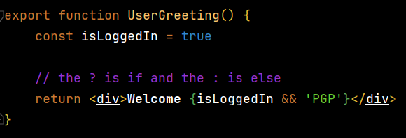

- we do this using &&
- What happens here `Welcome {isLoggedIn && 'PGP'}`, the expression evaluates the left hand side of the operator.
In case it's true it will also evaluate the right hand side of the operator and will append pgp.
- If the left side is false it will never evaluate the right side of the operator.

## displaying a list of items
I'm going to use the javascript map method to append a list of names to the browser.

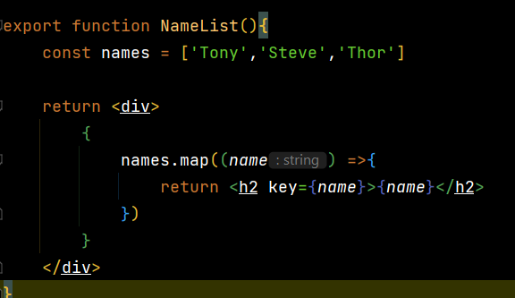

1) First I make a component NameList.
2) Then I make a function NameList and in that function I declare an array of names.
3) After that i will use the map method to go true the array and display this to the browser: ` names.map((name) =>{
   return <h2>{name}</h2>`.
4) In this case {name} is like in javascript the innerHtml.
5) We also add a key prop and assign an unique value `key={name}`. This will remove an error in the console

## Styling React components
There are a couple of options to style React components:

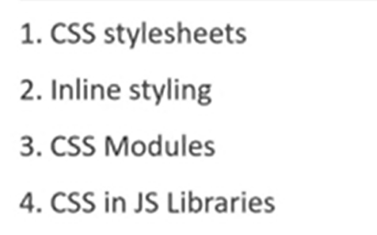

In this crash course I will only cover the first 3.

- Css stylesheets

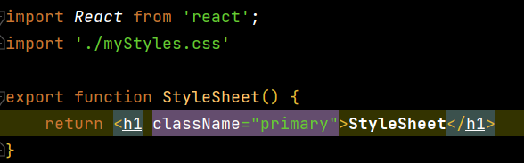
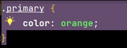

1) First I will create a Stylesheet component and also add a stylesheet.css.
2) I wil import the Css file to the stylesheet component.
3) In the css file I create a file primary and give it the color orange .
4) Then in the Stylesheet component I add a className and give it the name of primary `className="primary"` ,just like in the Css file.

- Inline styling

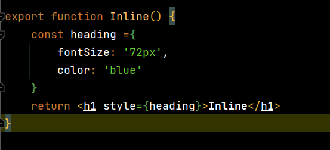

1) To do inline styling we need to create an object and add properties: `    const heading ={ fontSize: '72px', color: 'blue' }`.
2) The values are specified as a string.
3) To apply this style you need the style attribute and assign the object (header) `style={heading}`

- Css modules
- 
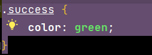
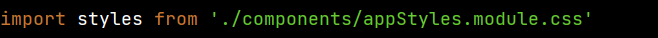

1) For this one I create a css file called appStyles.module.css
2) The import part for this css file is a little different, you need to call `styles from ....` to be able to use this file.
3) Then the inline styling you can do adding styles and calling again the styles from React `className={styles.success}`.

## Forms
In this basic I'm going to show the basics with forms in React. I will show hot to capture input html element and have the data available for form submission.

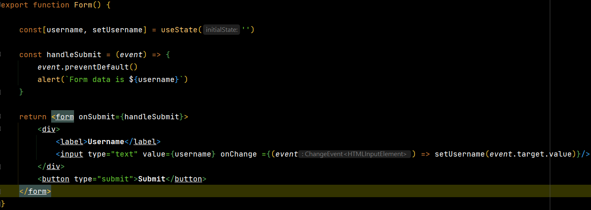

1) In this example I'm going to create a Form component.
2) I make a Form function with inside a form element with inside a div and inside a div a label with username and an input tex field.
3) To manage it with React I have to create a state variable to handle the value and change in value of this input element: ` const[username, setUsername] = useState('')`.
4) Then in the input element I assign username to the value attribute `value={username}`.
5) If you now try to type out in the input element, you're going to see that the input won't reflect the changes.
6) We need a onChange event to handle the changes and update the userState variable wit setUsername: `onChange ={(event) => setUsername(event.target.value)`
7) Next is trying to submit the form, so we add a submit button. The problem the page refreshes.
8) On the form tag I'm going to assign a handler to the on submit event: `onSubmit={handleSubmit}`.
9) Then we define this handler in a function. To prevent a submit refresh we call `event.preventDefault()`.
10) In the next line we alert the username ` alert(`Form data is ${username}`)`.

## ## HTTP GET & POST requests
In this topic I will explain how React works with HTTP.

With an example I'm going to make a GET request and how to make a POST request.

To fetch data, we need to have an api endpoint. For this I will be using jsonplaceholder https://jsonplaceholder.typicode.com/. This is a free API for testing prototyping.
In the Routes section I will be making a GET request to /post which will fetch an array of posts to display in the UI.

Get Request Example:

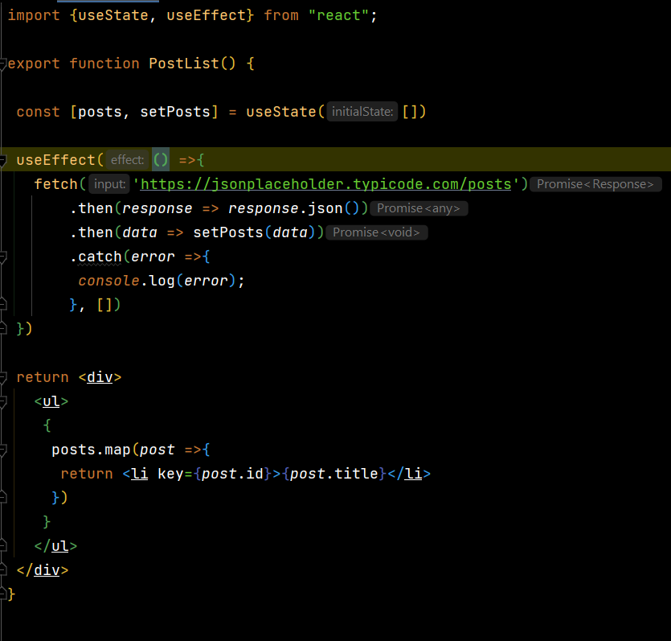
Explanation will be added.
Post Request Example:

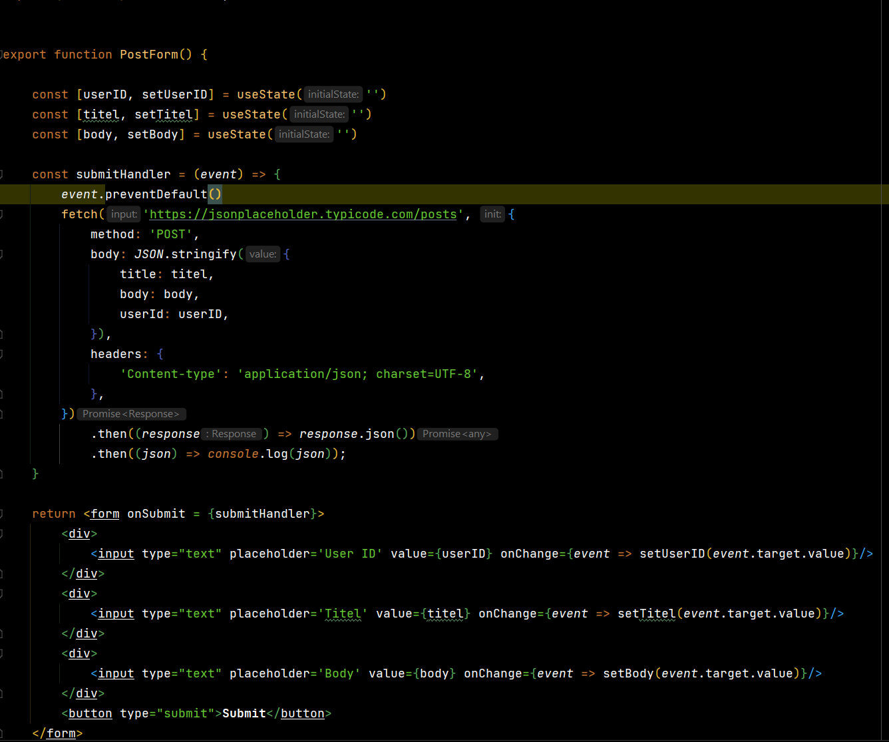
Explanation will be added.

## Transition hook

## Available Scripts

In the project directory, you can run:

### `npm start`

Runs the app in the development mode.\
Open [http://localhost:3000](http://localhost:3000) to view it in your browser.

The page will reload when you make changes.\
You may also see any lint errors in the console.

### `npm test`

Launches the test runner in the interactive watch mode.\
See the section about [running tests](https://facebook.github.io/create-react-app/docs/running-tests) for more information.

### `npm run build`

Builds the app for production to the `build` folder.\
It correctly bundles React in production mode and optimizes the build for the best performance.

The build is minified and the filenames include the hashes.\
Your app is ready to be deployed!

See the section about [deployment](https://facebook.github.io/create-react-app/docs/deployment) for more information.

### `npm run eject`

**Note: this is a one-way operation. Once you `eject`, you can't go back!**

If you aren't satisfied with the build tool and configuration choices, you can `eject` at any time. This command will remove the single build dependency from your project.

Instead, it will copy all the configuration files and the transitive dependencies (webpack, Babel, ESLint, etc) right into your project so you have full control over them. All of the commands except `eject` will still work, but they will point to the copied scripts so you can tweak them. At this point you're on your own.

You don't have to ever use `eject`. The curated feature set is suitable for small and middle deployments, and you shouldn't feel obligated to use this feature. However we understand that this tool wouldn't be useful if you couldn't customize it when you are ready for it.

## Learn More

You can learn more in the [Create React App documentation](https://facebook.github.io/create-react-app/docs/getting-started).

To learn React, check out the [React documentation](https://reactjs.org/).

### Code Splitting

This section has moved here: [https://facebook.github.io/create-react-app/docs/code-splitting](https://facebook.github.io/create-react-app/docs/code-splitting)

### Analyzing the Bundle Size

This section has moved here: [https://facebook.github.io/create-react-app/docs/analyzing-the-bundle-size](https://facebook.github.io/create-react-app/docs/analyzing-the-bundle-size)

### Making a Progressive Web App

This section has moved here: [https://facebook.github.io/create-react-app/docs/making-a-progressive-web-app](https://facebook.github.io/create-react-app/docs/making-a-progressive-web-app)

### Advanced Configuration

This section has moved here: [https://facebook.github.io/create-react-app/docs/advanced-configuration](https://facebook.github.io/create-react-app/docs/advanced-configuration)

### Deployment

This section has moved here: [https://facebook.github.io/create-react-app/docs/deployment](https://facebook.github.io/create-react-app/docs/deployment)

### `npm run build` fails to minify

This section has moved here: [https://facebook.github.io/create-react-app/docs/troubleshooting#npm-run-build-fails-to-minify](https://facebook.github.io/create-react-app/docs/troubleshooting#npm-run-build-fails-to-minify)
